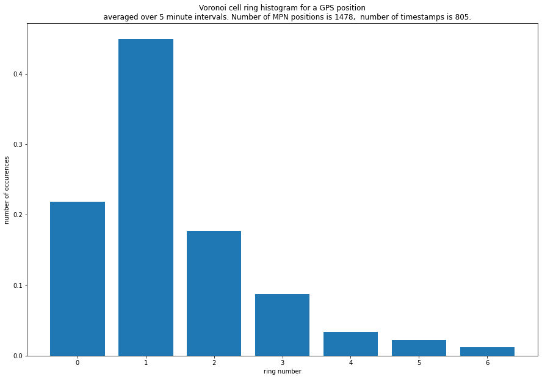

Modules
=======

The code takes CSV files located in the ``private_swedish_mind/data/``.
Each file represents data for a journey.

The files have the following format:

+-----+---------------------+-----------------------------+----------------------------+
| idx | timestamp           |       geometry_gps_csv      |        geometry_mpn_csv    |
+=====+=====================+=============================+============================+
| 0   | 2019-05-23 13:50:00 | [1541218.350, 8117969.018]  | [1546361.310, 8122021.062] |
+-----+---------------------+-----------------------------+----------------------------+
| 1   | 2019-05-23 14:30:00 | [1542727.347, 8114445.220]  | [1542862.167, 8117797.551] |
+-----+---------------------+-----------------------------+----------------------------+
| ... |        ...          |            ...              |                 ...        |
+-----+---------------------+-----------------------------+----------------------------+
|1048 |	2017-11-21 22:35:00 | [2090807.250, 8330158.612]  | [2088342.514, 8331062.918] |
+-----+---------------------+-----------------------------+----------------------------+

where  `geometry_gps_csv` and `geometry_mpn_csv` are  the coordinates according  to GPS and MPN correspondingly in the `EPSG=3857` projection.

Next, data is undergoing the following transformation:

* the  data are being cut by the given bounding area
* the bounding area is being tesselated by Voronoi polygons with antennas as their centers

.. image:: pics/track_within_shape.png
    :width: 600
    :alt: Alternative text

* for each GPS position, `geometry_gps_csv` we identify to which Voronoi cell it  belongs to and consider it  as a base cell
* for each base cell we build the rings of Voronoi cells, as the year rings for the tree.  In the picture below the blue color shows the base cell, while the 'green', 'cyan', 'red', 'black' define the colors for  the rings of the next level.

.. image:: pics/upp_vor_cell.png
    :width: 600
    :alt: Alternative text

* for each `geometry_gps_csv` we build cell rings and for corresponding `geometry_mpn_csv` figure out to which ring **layer** it falls into.  Based on that we build a histogram for the layer  occurancies after moving  through the table.

The number for `ring=0` tells the number of times when the GPS and MPN positions fall into the same Voronoi cell.
The number for `ring=1` shows the number of times when MPN position is in the first layer, and so forth.

*

.. automodule:: private_swedish_mind.private_swedish_mind
   :members:

.. automodule:: private_swedish_mind.utils
   :members:
